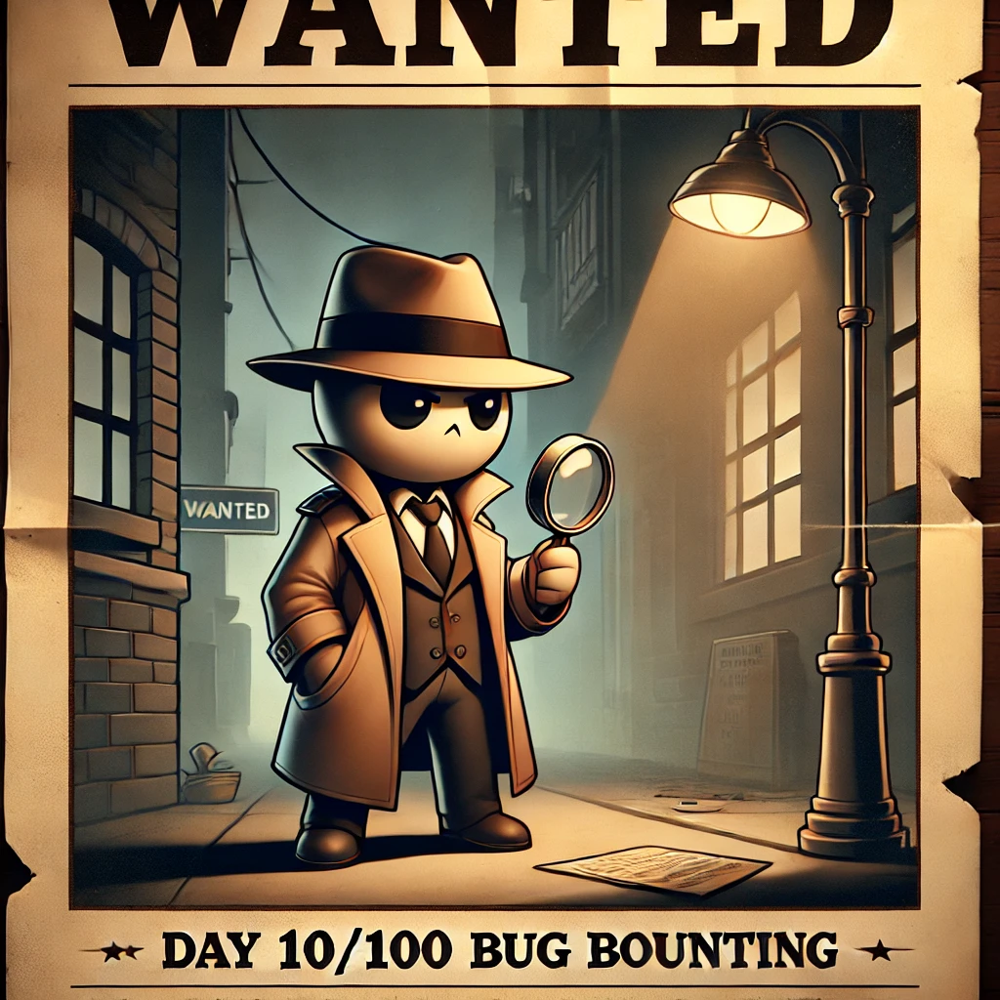

Today was more of a chill day focused on fixing my automated tool for recon and quick vulnerability checks. I didn’t dive too deep into hunting but took some time to do light reading and catch up on a few blogs

🐍 **Tool Features:**

- Fixing errors
- Code Cleanup

📚 **Resources:**

- https://tamimhasan404.medium.com/ffuf-tips-and-tricks-90fbe12e7c79
- Reading **Bug Bounty Bootcamp** by Vickie Li

&nbsp;