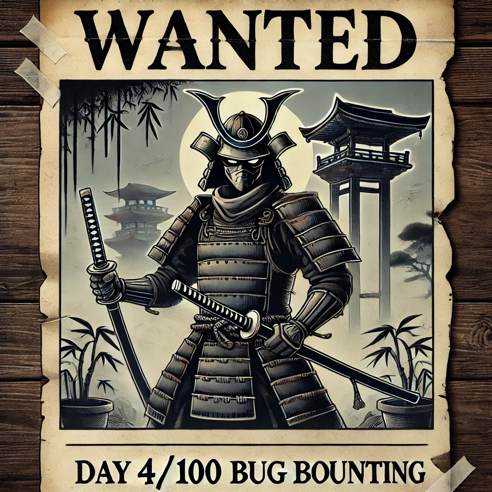

I've decided to shift my focus away from AWS certification and fully commit to bug bounty hunting. Since I don’t see AWS learning as directly related to bug bounties, I won’t be counting that time towards my bug bounty progress.

Moving forward, I'll continue working on my ARTE certification separately, but my main priority will be bug bounties. Each day, I’ll aim to read and pin three write-ups from successful bug bounty rewards.

Each day, I’ll aim to read and pin three write-ups from bug bounty rewards here. I’ll also be reading blogs/books related to bug bounty hunting / hacking to keep learning and improving my skills.

📚 **Resources:**

- https://infosecwriteups.com/finding-and-exploiting-s3-amazon-buckets-for-bug-bounties-6b782872a6c4
- https://medium.com/@dante.falls/how-to-find-and-test-s3-buckets-for-bug-bounty-b91166f9b4e0
- https://medium.com/@qaafqasim/the-ultimate-guide-to-hack-s3-buckets-data-leaks-and-discovery-techniques-40a29641d18b
- https://hackerone.com/blog/what-great-hackers-share
- https://forum.bugcrowd.com/t/researcher-resources-how-to-become-a-bug-bounty-hunter/1102
- https://whitton.io/articles/bug-bounties-101-getting-started/
- https://www.alphr.com/features/378577/q-a-the-life-of-a-bug-bounty-hunter/
- https://www.bugcrowd.com/blog/getting-started-bug-bounty-hunter-methodology
- https://hackerone.com/hacktivity/overview?queryString=disclosed%3Atrue&sortField=latest_disclosable_activity_at&sortDirection=DESC&pageIndex=0

Found this github repo with useful oneliners for the future:

- https://github.com/Elsfa7-110/Elsfa7110-Oneliner-bughunting

&nbsp;

&nbsp;