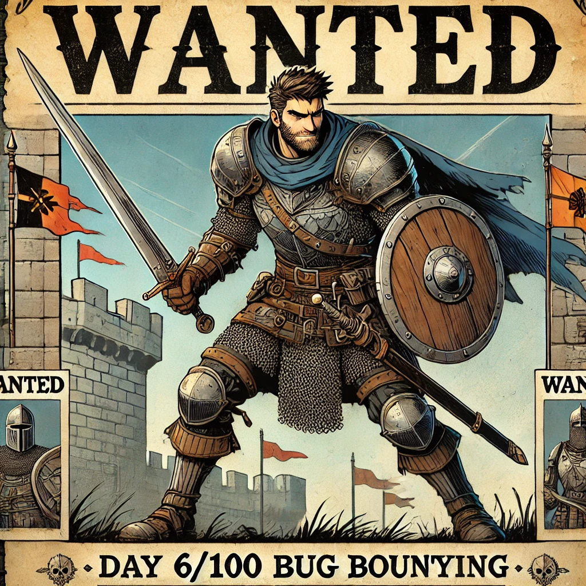

Today, I didn’t have much time, but I dedicated it to starting my automated tool. I’ve decided that each day I’ll leave a checklist of features I plan to add as I continue developing it. It’ll help me stay organized and track my progress.

The automated tool I’m working on will be focused on improving the efficiency of recon and performing some initial scanning tasks. As I continue learning about different attacks, I’ll be adding new features to the tool to make it even more versatile. The idea is to build something that not only saves time but also evolves as my skills grow.

🐍 **Tool features:**

- [x] Check alive domains with httpx
- [x] Save output to a directory

📚 **Resources:**

- Started reading **Bug Bounty Bootcamp** by Vickie Li

&nbsp;